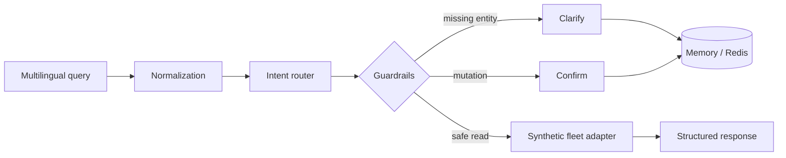

# Multilingual Fleet Operations Assistant

[](https://github.com/HayderCH/multilingual-fleet-ops-assistant/actions/workflows/tests.yml)
[](https://www.python.org/)
[](https://fastapi.tiangolo.com/)
[](LICENSE)

A clean-room portfolio implementation of a multilingual fleet assistant. It accepts French, Tunisian Arabic, Arabizi and basic English requests, maps them to an allowlisted operation, asks for missing information, and requires confirmation before a simulated state-changing action.

> **Portfolio and provenance notice**
>
> This repository was written from scratch for public demonstration. It contains no client source code, private API contract, production dataset, vehicle identifier, credential or proprietary model artifact. All fleet records and benchmark queries are synthetic.

## What it demonstrates

- multilingual normalization and intent routing across Latin and Arabic scripts;
- a reproducible character/word n-gram classifier trained only on newly generated synthetic data;
- structured FastAPI contracts with visible route evidence and confidence;
- multi-turn vehicle clarification using memory or Redis;
- confirmation gates for simulated ticket creation;
- deterministic fallback behavior with no paid LLM dependency;
- Docker deployment, automated tests and a reproducible public benchmark;
- a small responsive browser interface backed by the real API.

## Try it locally

```bash
python -m venv .venv
# Windows: .venv\Scripts\activate
# Linux/macOS: source .venv/bin/activate
pip install -e ".[dev]"
uvicorn fleet_assistant.api:app --reload
```

Open [http://localhost:8000](http://localhost:8000) for the demo or [http://localhost:8000/docs](http://localhost:8000/docs) for OpenAPI.

Example requests:

```text
Où est la voiture 4 ?
9addech khdem moteur karhba 2?
وين الكرهبة 4؟
Create a complaint for vehicle 2
```

Docker with Redis-backed sessions:

```bash
docker compose up --build
```

## API example

```bash
curl -X POST http://localhost:8000/chat \
  -H "Content-Type: application/json" \
  -d '{"text":"win karhba 4 tawa","conversation_id":"demo-1"}'
```

The response makes the decision inspectable:

```json
{
  "conversation_id": "demo-1",
  "status": "complete",
  "reply": "Demo Car 4 is currently in La Marsa.",
  "route": {
    "intent": "vehicle_location",
    "confidence": 0.88,
    "language": "tn_latn",
    "vehicle_id": 4,
    "evidence": ["win"]
  },
  "data": {
    "vehicle_id": 4,
    "city": "La Marsa",
    "latitude": 36.8782,
    "longitude": 10.3247,
    "synthetic": true
  }
}
```

## Public benchmark

Run the compact, openly inspectable benchmark:

```bash
fleet-benchmark
```

The benchmark contains 32 hand-curated synthetic queries across French, Tunisian Arabic, Arabizi, English and one mixed-script case. It is a reproducible smoke benchmark—not a substitute for independent real-user evaluation. Results are regenerated in CI rather than presented as client performance.

Train and inspect the public classifier:

```bash
fleet-train-classifier
curl -X POST http://localhost:8000/classify \
  -H "Content-Type: application/json" \
  -d '{"text":"win karhba 4 tawa"}'
```

The committed artifact is trained exclusively from the transparent templates in `training_data.py`. It is intentionally separate from the deterministic policy layer: classifier probabilities provide routing evidence, while allowlists, entity resolution and confirmation remain authoritative.

## Architecture



See [docs/ARCHITECTURE.md](docs/ARCHITECTURE.md) for trust boundaries and design decisions,
and [docs/MODEL_CARD.md](docs/MODEL_CARD.md) for classifier provenance, evaluation scope
and limitations.

## Repository map

```text
src/fleet_assistant/
  api.py          FastAPI entry point
  router.py       multilingual routing and entity extraction
  service.py      conversation policy and execution
  sessions.py     memory and Redis session stores
  catalog.py      synthetic fleet adapter
  benchmark.py    reproducible evaluation runner
  classifier.py   public intent-classifier inference
  training_data.py synthetic multilingual training templates
  static/         browser demo
tests/            routing, API, safety and benchmark tests
```

## Limitations

- The public router is intentionally lightweight and deterministic.
- Fleet responses are synthetic and must not be interpreted as live telemetry.
- The included benchmark is small and designed for transparency, not marketing.
- Redis fallback behavior and multi-worker deployment should be load-tested for a real service.

## Author

**Hayder Chakroun** — Junior Applied AI / Machine Learning Engineer

[LinkedIn](https://www.linkedin.com/in/hayderchakroun/) · [GitHub](https://github.com/HayderCH)
