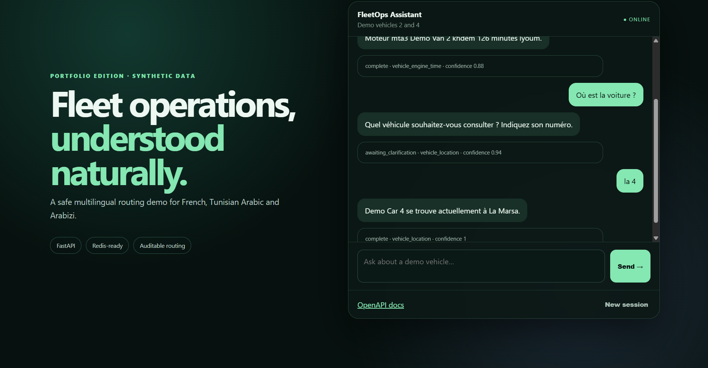
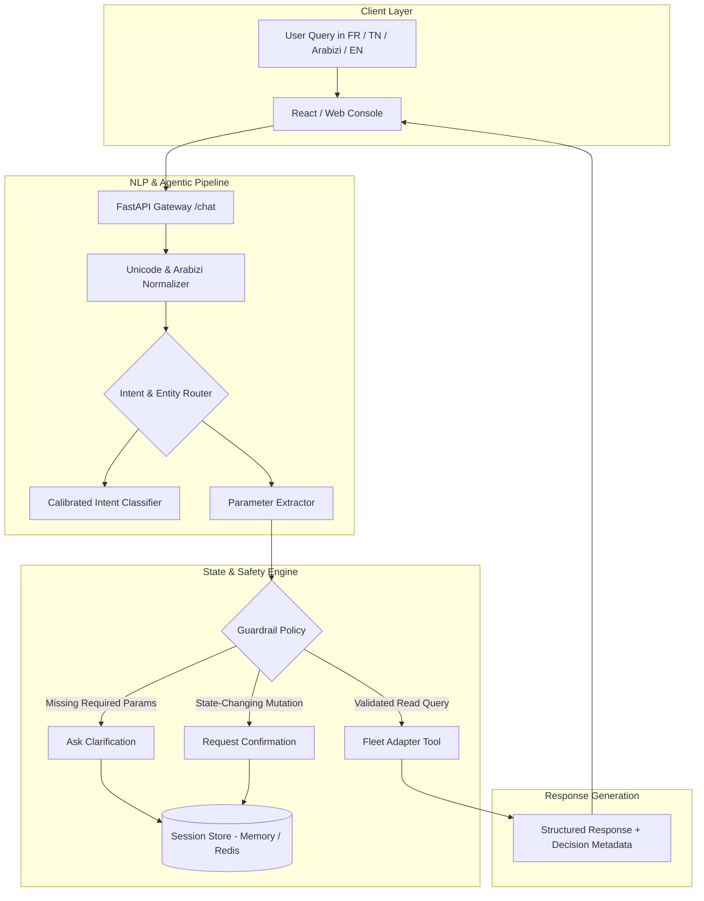

# Multilingual Fleet Operations Assistant (AI Engine)

[](https://www.python.org/)
[](https://fastapi.tiangolo.com/)
[](docker-compose.yml)
[](tests/)
[](#architecture--data-flow)
[](LICENSE)

An end-to-end, **100% self-contained local AI assistant** for fleet operations. It processes multilingual natural language queries across **French, Tunisian Arabic (Derja), Arabizi (Latin script with phonetic numerals), and English**, resolves intent and parameters, manages multi-turn clarification and confirmation state, and executes structured tool calls against fleet backends.

> [!NOTE]
> **Portfolio & Clean-Room Provenance Notice**  
> This repository is an open-source reference implementation written from scratch with synthetic data and mock adapters. It contains no proprietary client source code, credentials, or private vehicle telemetry.

---

## 📸 Interface Preview

<div align="center">
  
  <p><em>Interactive local web console demonstrating multi-turn clarification, Arabizi parsing, and inspectable routing decisions (intent, status, confidence score).</em></p>
</div>

---

## ⚡ Key AI Engineering Highlights

* **Multilingual & Arabizi Normalization:** Normalizes code-switched queries across Arabic script, French, English, and Arabizi (phonetic numbers like `3` for ع, `7` for ح, `9` for ق).
* **Agentic Guardrails & Tool Calling:** Strict schema validation isolates natural language understanding from execution; the assistant only triggers allowlisted operations with validated parameters.
* **Multi-Turn State & Clarification Loops:** Automatically identifies missing parameters (e.g. missing vehicle ID) and prompts the user for clarification before executing backend calls.
* **Confirmation Gates on State Mutations:** Enforces explicit user confirmation before executing state-changing actions (e.g., ticket/complaint creation).
* **Self-Contained & Reproducible:** Zero required cloud API keys or external paid LLM dependencies; runs entirely locally using FastAPI, scikit-learn / n-gram intent classification, and Redis-backed session memory.

---

## 🏗️ Architecture & Data Flow



---

## 🚀 Quickstart (Run 100% Locally)

### Option 1: Local Python (Zero Setup)

```bash
# 1. Create and activate virtual environment
python -m venv .venv
# Windows: .venv\Scripts\activate
# Linux/macOS: source .venv/bin/activate

# 2. Install dependencies
pip install -e ".[dev]"

# 3. Launch the server
uvicorn fleet_assistant.api:app --reload
```

* **Web UI Console:** [http://localhost:8000](http://localhost:8000)
* **OpenAPI Docs:** [http://localhost:8000/docs](http://localhost:8000/docs)

### Option 2: Docker Compose (with Redis Session Store)

```bash
docker compose up --build
```

---

## 💬 Sample Queries

| Language / Script | User Input | Resolved Intent |
| :--- | :--- | :--- |
| **French** | `Où est la voiture 4 ?` | `vehicle_location` |
| **Arabizi** | `win karhba 4 tawa` | `vehicle_location` |
| **Tunisian Arabic** | `وين الكرهبة 4؟` | `vehicle_location` |
| **Arabizi (Engine hours)** | `9addech khdem moteur karhba 2?` | `engine_hours` |
| **State Mutation (Ticket)** | `Create a complaint for vehicle 2` | `create_ticket` *(triggers confirmation gate)* |

---

## 🔬 API & Inspectable Decision Frame

```bash
curl -X POST http://localhost:8000/chat \
  -H "Content-Type: application/json" \
  -d '{"text":"win karhba 4 tawa","conversation_id":"demo-session-1"}'
```

**Response (exposing route evidence & parameters):**

```json
{
  "conversation_id": "demo-session-1",
  "status": "complete",
  "reply": "Demo Car 4 is currently in La Marsa.",
  "route": {
    "intent": "vehicle_location",
    "confidence": 0.88,
    "language": "tn_latn",
    "vehicle_id": 4,
    "evidence": ["win"]
  },
  "data": {
    "vehicle_id": 4,
    "city": "La Marsa",
    "latitude": 36.8782,
    "longitude": 10.3247,
    "synthetic": true
  }
}
```

---

## 📊 Public Benchmark & Test Suite

Run the automated test suite:

```bash
pytest -v
```

Run the reproducible benchmark runner (evaluates 32 synthetic multi-dialect queries):

```bash
fleet-benchmark
```

Train and inspect the local classifier:

```bash
fleet-train-classifier
```

---

## 📁 Repository Structure

```text
src/fleet_assistant/
  api.py            FastAPI entry point & endpoint routes
  router.py         Multilingual normalization, intent routing & entity extraction
  service.py        State machine, policy guardrails & conversation execution
  sessions.py       In-memory & Redis state persistence
  catalog.py        Synthetic fleet data adapter
  classifier.py     Local intent classifier inference
  training_data.py  Synthetic multilingual training corpus
  benchmark.py      Reproducible benchmark runner
  static/           Self-contained browser demo UI
tests/              Unit, safety, routing, and benchmark tests
docs/               Architecture decisions & model cards
```

---

## 👤 Author

**Hayder Chakroun** — Junior Applied AI / Machine Learning Engineer  
[LinkedIn](https://www.linkedin.com/in/hayderchakroun/) · [GitHub](https://github.com/HayderCH)

