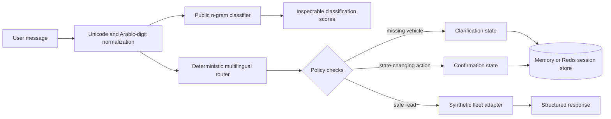

# Architecture

The public edition keeps model-like language understanding separate from trusted execution.

## Trust boundaries

- The router proposes an intent; it never supplies an arbitrary URL or executable operation.
- Only intents present in the public route catalogue can execute.
- Read operations use a synthetic in-process fleet adapter.
- Ticket creation is a simulated mutation and requires explicit confirmation.
- Conversation state can use memory locally or Redis in the container stack.
- Responses expose the chosen route, confidence and matched evidence for inspection.

## Why execution remains deterministic

The engineering problem involves low-latency routing in mixed French, Tunisian Arabic and Arabizi. This public edition exposes both an inspectable lexical router and a reproducible n-gram classifier trained from synthetic templates. The classifier makes probabilistic intent scores visible through `/classify`; the deterministic router remains authoritative for `/chat`. This keeps clarification, entity resolution, allowlists and confirmations reproducible without paid APIs or private assets. A future model can propose the same `RouteDecision` contract without changing the trusted policy and execution layer.

## Non-goals

- It is not connected to a real fleet.
- It does not reproduce a client's endpoints, labels or data model.
- The public benchmark is a compact synthetic smoke suite, not a claim about production traffic.
